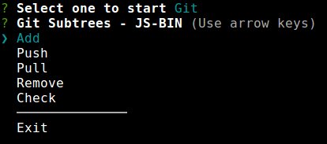
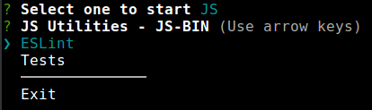
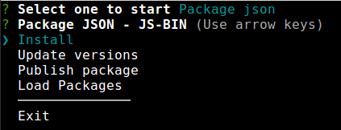

# js-bin
JS bin helpers.

**Install**
```
npm install js-bin
```

**Usage**

For launch a interactive menu execute (in the root folder of project):
```
node ./node_modules/.bin/js-bin
```


This package is composed by three big menus:

## Git helpers: 
Provides some commands to manage a simple tasks for git subtrees.

By default this command take a set of subtrees who indicate in `package.json`, attribute "config: subtree{}".

**Git subtree menu:**



## JS helpers:

Provides some commands to manage a js tasks:

- JS lint/ ES lint (Syntax checker)
- JS unit test (pass all tests in `/test` directory)

**JS Utilities:**



## Package.json helpers:


Provides some commands to manage a package.json file more easily:



#### Install dev

This command, add a package into a module (subtree), this package will added into file package.json (in `dependencies` or `devDependencies`, deppends envoirment parameter) of module, 
and will install into root project (`node_modules` folder).

#### Load dev packages

Load all module dependencies and devDependencies to root file package.json like devDependencies

#### Solve versions conflicts

Solve conflicts about versions from root project package.json, to module or modules package.json file.

#### Publish package

Publish package or module, to npm. (`Needs a .npmrc file to register package to a private npm repository`).